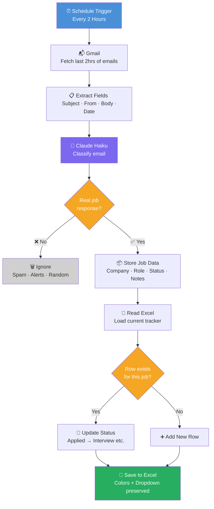

# Job Application Tracker

A self-hosted automation that silently monitors your Gmail every 2 hours, uses Claude AI to filter out spam and job alerts, and automatically updates an Excel tracker with the status of every real application — from first confirmation to offer or rejection.

Built with **n8n + Claude Haiku + Gmail OAuth + Python**.

---

## How It Works


**Status lifecycle tracked automatically:**

`Applied` → `Assessment` → `Interview` → `Rejected` / `Offer`

---

## Features

- 📬 **Batch email monitoring** — fetches all emails from the past 2 hours in one run
- 🤖 **AI-powered filtering** — Claude ignores LinkedIn blasts, Lensa alerts, newsletters, and random emails
- 🔄 **Smart deduplication** — if Apple emails you 3 times about the same role, it updates the row instead of creating duplicates
- 🎨 **Color-coded Excel** — each status has its own row color (blue = applied, yellow = assessment, green = interview, red = rejected)
- 📋 **Dropdown in Status column** — click any cell in column C to toggle status manually
- 🏃 **Runs forever in background** — Docker with `--restart always` keeps it alive across reboots

---

## Stack

| Tool | Purpose |
|---|---|
| [n8n](https://n8n.io) | Workflow automation engine (self-hosted) |
| [Claude Haiku](https://anthropic.com) | AI email classification |
| Gmail OAuth | Email monitoring |
| Python + openpyxl | Excel formatting with dropdowns + colors |
| Docker | Running n8n locally |

---

## Prerequisites

Before you start, make sure you have:

- [ ] **Mac or Linux** (Windows works too but paths will differ)
- [ ] **Docker** installed — [get it here](https://www.docker.com/products/docker-desktop)
- [ ] **Python 3** installed 
- [ ] **Anthropic API key** — [get one here](https://console.anthropic.com)
- [ ] **Gmail account** you use for job applications
- [ ] **Microsoft Excel** or Numbers to view the tracker

---

## Setup Guide

### Step 1 — Install openpyxl

```bash
pip3 install openpyxl --break-system-packages
```

---

### Step 2 — Create the Excel Tracker

Run this in Terminal to create a properly formatted Excel file with dropdowns and colors:

```bash
python3 << 'EOF'
import openpyxl
from openpyxl.styles import PatternFill, Font, Alignment
from openpyxl.worksheet.datavalidation import DataValidation
import os

wb = openpyxl.Workbook()
ws = wb.active
ws.title = 'Applications'

headers = ['Company', 'Role', 'Status', 'Date Applied', 'Last Updated', 'Sender', 'Notes']
header_fill = PatternFill("solid", fgColor="2F4F4F")
for col, header in enumerate(headers, 1):
    cell = ws.cell(row=1, column=col, value=header)
    cell.fill = header_fill
    cell.font = Font(bold=True, color="FFFFFF")
    cell.alignment = Alignment(horizontal="center")

widths = [20, 25, 15, 15, 15, 30, 40]
for col, width in enumerate(widths, 1):
    ws.column_dimensions[openpyxl.utils.get_column_letter(col)].width = width

dv = DataValidation(
    type="list",
    formula1='"Applied,Assessment,Interview,Rejected,Offer"',
    allow_blank=True,
    showDropDown=False
)
dv.sqref = "C2:C1000"
ws.add_data_validation(dv)
ws.freeze_panes = "A2"

path = os.path.expanduser('~/Desktop/JobRadar/job-tracker.xlsx')
os.makedirs(os.path.dirname(path), exist_ok=True)
wb.save(path)
print("Created:", path)
EOF
```

---

### Step 3 — Create the Python Update Script

Check update_tracker.py (This script writes data back to Excel while preserving formatting and dropdowns)

---

### Step 4 — Start n8n with Docker

```bash
docker run -d --restart always --name n8n \
  -p 5678:5678 \
  -v ~/.n8n:/home/node/.n8n \
  -v ~/Desktop/JobRadar:/home/node/.n8n-files \
  docker.n8n.io/n8nio/n8n
```

Open **http://localhost:5678** in your browser and create an account.

---

### Step 5 — Import the Workflow

1. In n8n, click **"+ New Workflow"** → **"Import from file"**
2. Upload `jobradar-workflow.json` from this repo
3. You'll see 9 nodes appear on the canvas

---

### Step 6 — Connect Gmail

You need to create a Google OAuth app to let n8n read your Gmail:

1. Go to [console.cloud.google.com](https://console.cloud.google.com) → create a new project
2. Search for **"Gmail API"** → click **Enable**
3. Go to **APIs & Services** → **OAuth consent screen** → External → fill in app name + email
4. Add yourself as a **Test User**
5. Go to **Credentials** → **+ Create Credentials** → **OAuth Client ID** → Web application
6. Add this to **Authorized redirect URIs**:
   ```
   http://localhost:5678/rest/oauth2-credential/callback
   ```
7. Copy your **Client ID** and **Client Secret**
8. In n8n, click the **Gmail Trigger** node → create new credential → paste both values → Sign in with Google

---

### Step 7 — Add Your Anthropic API Key

1. Go to [console.anthropic.com](https://console.anthropic.com) → API Keys → Create Key
2. In n8n, click the **AI Classify Email** node
3. In the Headers section, find the `x-api-key` field → paste your `sk-ant-...` key

---

### Step 8 — Update File Path

In the **Read Excel File** node and **Save Excel File** node, make sure the path is:
```
/home/node/.n8n-files/job-tracker.xlsx
```

This maps to `~/Desktop/JobRadar/job-tracker.xlsx` on your Mac via the Docker volume mount.

---

### Step 9 — Publish

Click **Publish** (top right) — the bot is now live and will run every 2 hours automatically.

---

## Excel Tracker Columns

| Column | Description |
|---|---|
| Company | Company name (AI-extracted) |
| Role | Job title (AI-extracted) |
| Status | Applied / Assessment / Interview / Rejected / Offer |
| Date Applied | Date first email detected |
| Last Updated | Date status last changed |
| Sender | Email address of the sender |
| Notes | One-line AI summary of the email |

---

## Workflow Nodes

| Node | What it does |
|---|---|
| Schedule Trigger | Fires every 2 hours |
| Gmail — Get Many | Fetches emails from past 2 hours |
| Extract Email Fields | Pulls subject, from, body, date |
| AI Classify Email | Sends to Claude Haiku for classification |
| Parse AI Response | Parses Claude's JSON output |
| Is Job Response? | Filters — only real job emails continue |
| Store Job Data | Saves parsed data for later use |
| Read Excel File | Reads current tracker |
| Parse Excel Rows | Converts to rows |
| Update or Add Row | Deduplicates and updates/adds row |
| Code (Python) | Writes back to Excel with formatting preserved |

---

## Troubleshooting

**Workflow runs but nothing gets added to Excel**
→ The AI is classifying emails as non-job-responses. Check the `Is Job Response?` node output — look at the `notes` field to see why Claude rejected it.

**Rate limit error from Anthropic**
→ Add a **Wait** node (2 seconds) between Extract Email Fields and AI Classify Email.

**File path error**
→ Make sure Docker was started with the `-v ~/Desktop/JobRadar:/home/node/.n8n-files` flag.

**Gmail not triggering**
→ Ensure OAuth is connected and the workflow is Published (not just saved).

**Dropdown disappears after workflow runs**
→ Make sure you're using the Python Code node at the end (not the built-in Excel nodes which strip formatting).

---

## Roadmap / Phase 2 Ideas

- [ ] Morning briefing email at 8 AM with full pipeline summary
- [ ] Auto-draft follow-up emails for applications ghosted > 7 days
- [ ] Telegram/WhatsApp instant alert when Interview or Offer detected
- [ ] Google Sheets version for cloud access

---

## License

MIT 
